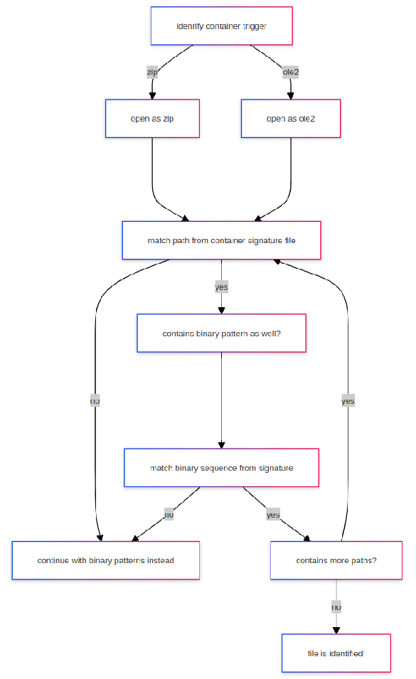

# PRONOM signature development guide

## TOC

\<\!-- via: https://luciopaiva.com/markdown-toc/ \--\>

## Introduction

PRONOM records two types of file format signature:

* Standard signatures.
* Container signatures.

Standard signatures can be used on all file types and they are used to identify consistent patterns and sequences in those files to then assign an identifier.

Container signatures operate on ZIP files, OLE2 files, and GZIP files, which are all container file formats.

As container file formats can contain files and directories, container signatures function by:

1. identifying a consistent path in a container file
2. Optionally testing a standard signature pattern against that path

We will look at both types of signature below and describe how to construct them; before that, we must talk about something called syntax.

## Syntax

Syntax is described in the written language as the set of rules that describe how words and phrases are arranged to make well-formed sentences. Syntax is one of the foundations of language and one of the keys to being able to express oneself well.

In programming, syntax describes the way words and symbols are structured and arranged to create functioning software. Similar to the written language, programming syntax enables developers to express themselves in code and create increasingly complex and nuanced pieces of software.

PRONOM uses a language which has a syntax. This syntax describes "file format sequences" and the syntax is limited to a strict definition. The syntax is a form of regular expression which is a method for identifying patterns.

When syntax is combined, in written language, code, or in PRONOM, the result is a structured set of words and symbols that take on semantic meaning, that is, you can read the combination of symbols and determine what they describe or what they mean. In language the result might be a poem. In PRONOM the result is a set of instructions for sets of bytes, or wildcards, that must, or must not exist in a file, at calculable positions, where if everything matches, we can say,

| *"* | *This file conforms to what is described in this signature's syntax. As such, this file is of the type described by this signature.* |
| ----: | :---- |

## PRONOM syntax

| Syntax element | Intended use | Example |
| ----- | ----- | ----- |
| Literal sequence | Just a plain signature sequence that appears as-is | A1B2C3D4 |
| Infinite wildcard: \* | The following sequence will appear at any point further in the file | A1B2C3D4\*E5F6A7B8 |
| Precise wildcard: {n} | The following sequence will appear after exactly the number of bytes specified | A1B2C3D4{4}E5F6A7B8 |
| Wildcard range: {m-n} | The following sequence will appear at some point between the number of bytes specified | A1B2C3D4{4-8}E5F6A7B8 |
| Either/Or: (a|b) | The following sequence will be any of the sequences specified. Any number of sequences can be specified | A1B2C3D4(0D|0A|0D0A)E5 |
| Byte range \[a:b\] | The next byte will be within the range specified | A1B2C3D4\[A4:B0\]E5 |
| NOT sequence: \[\!a\] | The following byte value is not this byte | A1B2C3D4\[\!E5\]F6 |
| Wildcard with infinite range: {m-\*} | The following sequence will appear minimally after the first value specified, but otherwise anywhere else in the file | A1B2C3D4{4-\*}E5F6A7B8 |
| Single wildcard: ?? | The following byte may have any value. This is functionally equivalent to {1} | A1B2C3D4??E5F6A7B8 |
| NOT Byte range \[\!a:b\] | The next byte will not be within the range specified | A1B2C3D4\[\!A4:B0\]E5 |

## PRONOM positions

PRONOM signatures work from an offset at one of three positions:

BOF: Beginning Of File \- the signature sequence starts at, or near the beginning of the file
EOF: End Of File \- the signature sequence starts at, or near the end of the file
Var: Variable \- the signature sequence may be found anywhere within the file
Offset \- the position, relative to the BOF, or EOF, where the sequence begins. 0 is default, meaning no offset. Since an offset of 0 means ‘starting from the first byte’, an offset of 4 means ‘starting from the 5th byte’, or ‘after the 4th byte’
Maximum Offset \- A further offset, relative to the initial Offset value described above. The default is 0, meaning no further possible offset.

### Position examples

BOF, Offset 0, Maximum offset 0: The signature sequence starts at the very beginning of the file

BOF, Offset 4, Maximum offset 0: The signature sequence starts at exactly position 0x04, the 5th byte

BOF, Offset 0, Maximum offset 4: The signature sequence may start anywhere within the first 5 bytes

BOF, Offset 4, Maximum Offset 4: The signature sequence may start anywhere from byte 5 through to byte 9

EOF, Offset 4, Maximum Offset 0: The signature sequence ends exactly 4 bytes from the end of the file

EOF, Offset 4, Maximum Offset 4: The signature sequence may end anywhere from 4 bytes to 8 bytes from the end of the file

*\> Syntax can also be used to describe offsets, e.g. using a precise wildcard or wildcard range:*:

| Syntax element | Intended use | Example |
| ----- | ----- | ----- |
| Wildcards at a beginning of a BOF sequence, or end of an EOF sequence | This is functionally equivalent to specifying Offset/Maximum Offset, however this is not recommended | {4}A1B2C3D4 or: {0-4}A1B2C3D4 |

## PRONOM semantics

PRONOM signatures can be combined any way whatsoever, but they will usually be some form of literal sequence that combines some wildcard elements that help account for any variability or uncertainty about what we know about a file format's structure.

Once PRONOM signatures are combined we can begin to understand their semantics. A handful of basic examples are described below:

| Bytestream | Sequence | Plain-language description |
| :---- | :---- | :---- |
|  |  |  |
|  |  |  |
|  |  |  |

## PRONOM signature files

PRONOM signature files are described in Extensible Markup Language (XML). While you might not engage with this view of a signature file very often, knowing how the file is structured helps you debug issues and helps developers with the process of creating software that implements these standards.

### Standard signature files

There are two primary sections within a FFSignatureFile element each have a one to many relationship to children describing standard signatures and metadata about file formats associated with those.

| Element | InternalSignatureCollection  | Child of FFSignatureFile | A collection of standard signatures as described in PRONOM  | Cardinality: 1 |
| :---- | :---- | :---- | :---- | :---- |
| Element | InternalSignature  | Child of InternalSignatureCollection | Describes sets of sequences specific to a PRONOM record and describes an internal ID to enable a mapping between \`InternalSignature\` and \`FileFormat\`  | Cardinality: 1 to many |
| Element | FileFormatCollection | Child of FFSignatureFile | A collection of descriptive metadata blocks, for each PUID described in PRONOM that also has a file format extension or a standard signature | Cardinality: 1 |
| Element | FileFormat | Child of FileFormatCollection | Describes format name, PUID, extension. Child elements map this format record to an \`InternalSignature\`; optionally lists priorities over or under another identifier to prevent falst-positives. | Cardinality: 1 to many |

In XML this looks as follows:

NB. XML comments are used to provide further description.

```xml
<?xml version="1.0" encoding="UTF-8"?>
<FFSignatureFile xmlns="http://www.nationalarchives.gov.uk/pronom/SignatureFile" Version="1" DateCreated="2026-09-03T12:22:45">
 <InternalSignatureCollection>
  <InternalSignature ID="2" Specificity="Specific">
        <ByteSequence Reference="BOFoffset" Sequence="" MinOffset="" MaxOffset="" />
        <ByteSequence Reference="BOFoffset" Sequence="" MinOffset="" MaxOffset="" />
  </InternalSignature>
  <InternalSignature ID="3" Specificity="Specific">
        <ByteSequence Reference="BOFoffset" Sequence="" MinOffset="" MaxOffset="" />
        <ByteSequence Reference="BOFoffset" Sequence="" MinOffset="" MaxOffset="" />
  </InternalSignature>
  <InternalSignature ID="4" Specificity="Specific">
        <ByteSequence Reference="BOFoffset" Sequence="" MinOffset="" MaxOffset="" />
        <ByteSequence Reference="BOFoffset" Sequence="" MinOffset="" MaxOffset="" />  </InternalSignature>
 </InternalSignatureCollection>
 <FileFormatCollection>
  <FileFormat ID="1" Name="Development Signature" PUID="dev/1" Version="1.0" MIMEType="application/octet-stream">
   <Extension>ext</Extension>
      <Extension>json</Extension>
      <HasPriorityOverFileFormatID>2</HasPriorityOverFileFormatID>
      <HasPriorityOverFileFormatID>3</HasPriorityOverFileFormatID>
      <HasPriorityOverFileFormatID>1</HasPriorityOverFileFormatID>
  </FileFormat>
  <FileFormat ID="2" Name="ZIP Format" PUID="x-fmt/263" Version="" MIMEType="application/zip">
   <InternalSignatureID>2</InternalSignatureID>
   <Extension>zip</Extension>
      <Extension>json</Extension>
      <HasPriorityOverFileFormatID>2</HasPriorityOverFileFormatID>
      <HasPriorityOverFileFormatID>3</HasPriorityOverFileFormatID>
      <HasPriorityOverFileFormatID>1</HasPriorityOverFileFormatID>
  </FileFormat>
  <FileFormat ID="3" Name="Microsoft Office Open XML" PUID="fmt/189" Version="" MIMEType="application/octet-stream">
   <InternalSignatureID>3</InternalSignatureID>
      <Extension>json</Extension>
      <HasPriorityOverFileFormatID>2</HasPriorityOverFileFormatID>
      <HasPriorityOverFileFormatID>3</HasPriorityOverFileFormatID>
      <HasPriorityOverFileFormatID>1</HasPriorityOverFileFormatID>
  </FileFormat>
  <FileFormat ID="4" Name="OLE2 Compound Document Format" PUID="fmt/111" Version="" MIMEType="application/octet-stream">
   <InternalSignatureID>4</InternalSignatureID>
      <Extension>json</Extension>
      <HasPriorityOverFileFormatID>2</HasPriorityOverFileFormatID>
      <HasPriorityOverFileFormatID>3</HasPriorityOverFileFormatID>
      <HasPriorityOverFileFormatID>1</HasPriorityOverFileFormatID>
  </FileFormat>
 </FileFormatCollection>
</FFSignatureFile>
```

### Container signature files

Three primary sections within a ContainerSignatureMapping element with some child sections with added relevance:

| Element | ContainerSignatures | Child of ContainerSignatureMapping | Describes a format, and consists of sets of files expected to be consistently found within that container type. Provides an Internal ID to link it to a PUID under File Format Mappings.  | Cardinality 1 to many |
| :---- | :---- | :---- | :---- | :---- |
|  | Description | Child of ContainerSignatures | Short description of the container file format | Cardinality: 1 |
|  | File | Child of ContainerSignatures | A list of file paths, and optional byte patterns specific to the file format being described. | Cardinality 1 to many |
| Element | FileFormatMappings | Child of ContainerSignatureMapping | A list of mappings between the ContainerSignature ID and PUID as it is found in PRONOM's signature file | Cardinality 1 to many |
|  | FileFormatMapping | Child of FileFormatMappings | Describes a one-to-one mapping between container signature ID and a PRONOM unique identifier | Cardinality one to many |
| Element | TriggerPuids | Child of ContainerSignatureMapping | A list of PUIDs that will trigger an attempted container identification in DROID  | Cardinality 1 to many |
|  | TriggerPUID | Child of TriggerPuids | Lists the PUIDs that will trigger container identification from DROID | Cardinality one to many |

In XML this looks as follows:

\> NB. XML comments are used to provide further description.

```xml
<?xml version="1.0" encoding="UTF-8"?>
<ContainerSignatureMapping SchemaVersion="1.0" SignatureVersion="1">
 <ContainerSignatures>
  <ContainerSignature Id="1" ContainerType="OLE2">
   <Description>Container description</Description>
   <Files>
    <File>
     <Path>path/to/file</Path>
     <BinarySignatures>
      <InternalSignatureCollection>
       <InternalSignature ID="1">
        <ByteSequence Reference="BOFoffset" Sequence="" MinOffset="" MaxOffset="" />
       </InternalSignature>
      </InternalSignatureCollection>
     </BinarySignatures>
    </File>
   </Files>
  </ContainerSignature>
 </ContainerSignatures>
 <FileFormatMappings>
  <FileFormatMapping signatureId="1" Puid="dev/1"></FileFormatMapping>
 </FileFormatMappings>
 <TriggerPuids>
  <TriggerPuid ContainerType="OLE2" Puid="fmt/111"></TriggerPuid>
  <TriggerPuid ContainerType="ZIP" Puid="fmt/189"></TriggerPuid>
  <TriggerPuid ContainerType="ZIP" Puid="x-fmt/263"></TriggerPuid>
 </TriggerPuids>
</ContainerSignatureMapping>
```

## Templates for DROID

### Standard signature files

```xml
<?xml version="1.0" encoding="UTF-8"?>
<FFSignatureFile xmlns="http://www.nationalarchives.gov.uk/pronom/SignatureFile" Version="1" DateCreated="2026-09-03T12:22:45">
 <InternalSignatureCollection>
  <InternalSignature ID="2" Specificity="Specific">
   <ByteSequence Reference="BOFoffset">
    <SubSequence Position="1" MinFragLength="0" SubSeqMinOffset="0" SubSeqMaxOffset="4">
     <Sequence>504B0304</Sequence>
    </SubSequence>
   </ByteSequence>
   <ByteSequence Reference="EOFoffset">
    <SubSequence Position="1" MinFragLength="0" SubSeqMinOffset="61" SubSeqMaxOffset="65565">
     <Sequence>504B01</Sequence>
    </SubSequence>
   </ByteSequence>
   <ByteSequence Reference="EOFoffset">
    <SubSequence Position="1" MinFragLength="0" SubSeqMinOffset="0" SubSeqMaxOffset="65535">
     <Sequence>504B0506</Sequence>
    </SubSequence>
   </ByteSequence>
  </InternalSignature>
  <InternalSignature ID="3" Specificity="Specific">
   <ByteSequence Reference="BOFoffset">
    <SubSequence Position="1" MinFragLength="0" SubSeqMinOffset="0" SubSeqMaxOffset="0">
     <Sequence>504B0304</Sequence>
    </SubSequence>
   </ByteSequence>
   <ByteSequence Reference="BOFoffset">
    <SubSequence Position="1" MinFragLength="0" SubSeqMinOffset="4" SubSeqMaxOffset="30">
     <Sequence>5B436F6E74656E745F54797065735D2E786D6C20A2</Sequence>
    </SubSequence>
   </ByteSequence>
   <ByteSequence Reference="EOFoffset">
    <SubSequence Position="1" MinFragLength="0" SubSeqMinOffset="0" SubSeqMaxOffset="65535">
     <Sequence>504B0102</Sequence>
    </SubSequence>
   </ByteSequence>
   <ByteSequence Reference="EOFoffset">
    <SubSequence Position="1" MinFragLength="0" SubSeqMinOffset="0" SubSeqMaxOffset="65535">
     <Sequence>504B0506</Sequence>
    </SubSequence>
   </ByteSequence>
  </InternalSignature>
  <InternalSignature ID="4" Specificity="Specific">
   <ByteSequence Reference="BOFoffset">
    <SubSequence Position="1" MinFragLength="0" SubSeqMinOffset="0" SubSeqMaxOffset="0">
     <Sequence>D0CF11E0A1B11AE1</Sequence>
    </SubSequence>
   </ByteSequence>
   <ByteSequence Reference="BOFoffset">
    <SubSequence Position="1" MinFragLength="0" SubSeqMinOffset="0" SubSeqMaxOffset="28">
     <Sequence>FEFF</Sequence>
    </SubSequence>
   </ByteSequence>
  </InternalSignature>
 </InternalSignatureCollection>
 <FileFormatCollection>
  <FileFormat ID="1" Name="Development Signature" PUID="dev/1" Version="1.0" MIMEType="application/octet-stream">
   <Extension>ext</Extension>
  </FileFormat>
  <FileFormat ID="2" Name="ZIP Format" PUID="x-fmt/263" Version="" MIMEType="application/zip">
   <InternalSignatureID>2</InternalSignatureID>
   <Extension>zip</Extension>
  </FileFormat>
  <FileFormat ID="3" Name="Microsoft Office Open XML" PUID="fmt/189" Version="" MIMEType="application/octet-stream">
   <InternalSignatureID>3</InternalSignatureID>
  </FileFormat>
  <FileFormat ID="4" Name="OLE2 Compound Document Format" PUID="fmt/111" Version="" MIMEType="application/octet-stream">
   <InternalSignatureID>4</InternalSignatureID>
  </FileFormat>
 </FileFormatCollection>
</FFSignatureFile>

```

### Container signature files

…
https://github.com/exponential-decay/droid-signature-files/blob/master/signature-file-templates/DROID-container-id-container-base-file.xml

## Worked examples

### Standard signature example

Here is a real-world signature example taken from PRONOM:

\* Position type: Absolute from BOF
\* Offset: 0
\* Value: \<code\>FFD8FFE0{2}4A464946000100(00|01|02)\</code\>
\* Position type: Absolute from EOF
\* Offset: 0
\* Maximum Offset: 65536
\* Value: FFD9

\[fmt/42 \- JPEG 1.00\](https://www.nationalarchives.gov.uk/PRONOM/fmt/42).

#### Process

1. add to …
2. add to…
3.

### Container signature example

…

#### Process

1. add to standard sig…
2. add to …
3.

## Use in DROID

DROID has two directories for signature files under the following location:

USER\_HOME/.droid6
The directories are:

signature\_files
container\_sigs

Standard signature files must be placed in signature\_files and container signature files must be placed in container\_sigs

## Use in ROY

https://github.com/richardlehane/siegfried/wiki/Building-a-signature-file-with-ROY#pronom-signature-development

roy build extend…

## Signature development utility

The signature development utility makes it easier to create signature files by hiding the need to write XML from you.

## Cheatsheet

#### PRONOM terms, basic syntax and data model

##### Offset markers

\*\*BOF\*\* \= Beginning of File.

\*\*EOF\*\* \= End of File. Var \= Variable (anywhere in the file)

\*\*Offset/Max Offset\*\* \= Exact or positional range in which a signature starts

##### Wildcards

\*\*??\*\* \= single wildcard byte, e.g. \<code\>AB??C3\</code\>

\*\*\\\*\*\* \= 0-many wildcard bytes, e.g \<code\>BC\*D4\</code\>

\*\*{n}\*\* \= specific number of wildcard bytes, e.g. \<code\>A2{5}F3\</code\>

\*\*{n-n}\*\* \= range of wildcard bytes, e.g. \<code\>4D{0-12}E4\</code\>

##### Byte range

\*\*\[hh:hh\]\*\* \= single byte value between range, e.g \<code\>\[00:FA\]\</code\>

##### Either/or

\*\*(hhhh|hhhh|hh)\*\* \= either/any or these byte values,
e.g. \<code\>(0D|0A|0D0A)\</code\>

##### Not

\*\*\[\!hh\]\*\* \= anything except this byte value, e.g. \<code\>ABCD\[\!01\]E1\</code\>

### Glossary

…

## Credits

* David
* Francesca
* Tyler

> NB. and everyone else who has contributed to this knowledge resource over
the years

## Informative references

* https://exponentialdecay.co.uk/blog/declarative-all-the-way-down-building-pronom-signatures-with-jsonid/

* ahttps://openpreservation.org/blogs/droid-container-signature-files-what-they-are-and-how-to-create-them-a-template-and-an-example-or-few/

* https://ffdev-info.github.io/searching-for-a-signature/

<hr>

## Unused


